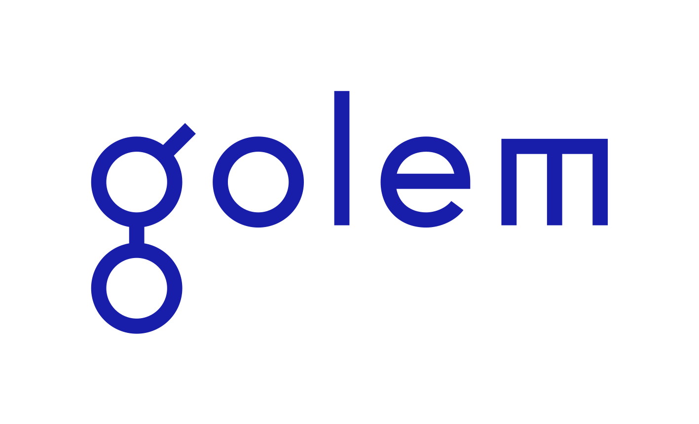

# Awesome Golem  

> Welcome to **Awesome Golem**, a community-curated list of resources, links, projects, tools and applications on Golem!

The users of Golem run the reference implementation in the form of Yagna. Together they make up the Golem Network, a P2P marketplace for computational resources where individuals can act as one of the two non-exclusive roles; a provider selling idle resources, or a requestor buying resources to run tasks.

## Contents

- [Golem](#golem)
- [Apps](#apps)
  - [Docker](#docker)
  - [Testing](#testing)
  - [Games](#games)
  - [Data Analysis](#data-analysis)
  - [Data Simulation](#data-simulation)
  - [Data Optimization](#data-optimization)
  - [Finance](#finance)
  - [Machine Learning](#machine-learning)
  - [Deep Learning](#deep-learning)
  - [RNG](#rng)
  - [Password Cracking](#password-cracking)
  - [DeFi](#defi)
  - [User Interfaces](#user-interfaces)
  - [Miscellaneous](#miscellaneous)
- [Developer and requestor resources](#developer-and-requestor-resources)
- [Provider resources](#provider-resources)
  - [Monitoring](#monitoring)
  - [Provisioning](#provisioning)
- [Learning resources](#learning-resources)
  - [Presentations and workshop material](#presentations-and-workshop-material)
  - [Unraveling Golem's The Next Milestone blog series](#unraveling-golems-the-next-milestone-blog-series)
  - [GitHub Digest blog series](#github-digest-blog-series)
- [Community](#community)

## Golem

- [Golem Network Platform](https://www.golem.network/platform) - Learn the Golem platform on the official Golem Network website.
- [Golem Factory GitHub](https://github.com/golemfactory) - Where you can find the open source code of all things Golem!
- [Yagna GitHub](https://github.com/golemfactory/yagna) - The official Rust implementation of Golem.
- [Golem Community Chat](https://chat.golem.network/) - Join the community and team open discussion on Discord.
- [Reddit](https://reddit.com/r/GolemProject) - Golem Network discussion on the Reddit platform.
- [Twitter](https://twitter.com/golemproject) - The Golem Project Twitter.
- [Blog](http://blog.golemproject.net/) - The official blog where you can find the most reliable information on announcements, summaries and updates.

## Apps
- [Golem Slate](https://github.com/deutschklub/golem-slate) - SLATE is a code pen SPA for writing a requester script to have work computed by the golem network. It utilizes dockerized yagna environments to communicate with the Golem Network in the background. Hosted [here](https://golem-slate.xyz/).
- [Golem Network Video Transcoder](https://github.com/Doc-Saintly/golem-video) - A sample app that uses golem.network to transcode videos. Please select your transcoding profile and then upload your videos.
- [Golem Transcoding requestor](https://github.com/Edhendil/golem-transcoding) - A React + Spring based webapp accepting video files as input and transcoding these files into different formats.
- [Go le' Machin](https://github.com/DEUTSCHKLUB/go-le-m) - Web based bulk image editor that allows users to upload multiple images and apply bulk actions to them.

### Docker
- [Golem Requestor Node](https://github.com/DerekJarvis/general-golem) - A dockerized requestor environment. You can just pass in the py script  (example uses the blender demo) and it sets up the daemon and runs it.

### Testing
- [Golem Test Harness (Goth)](https://github.com/golemfactory/goth) - A tool with the purpose of speeding up your development process and making it more enjoyable for application creators ([demo video](https://youtu.be/HP6VVBUdkm8)).
- [Golem-afl](https://github.com/sladecek/golem-afl) - Golem-afl is an experimental test-fuzzing framework. Assists in finding security holes.
- [Golem Cargo Test](https://github.com/sladecek/golem_cargo_test) - Golem Cargo Test is an adaptive distributed test executor for rust projects.
- [Golem CI](https://github.com/hhio618/golem-ci) - Decentralized task pipeline.

### Games
- [Chess on Golem](https://github.com/broadcastmonkey/ChessOnGolem) - A react frontend for the 2 AI's playing against each other through the Golem backend, that computes each others next move.
- [Golem Sudoku](https://github.com/Dodecane/golem-sudoku) - Game of Sudoku with size variants.
- [HSOG-requester](https://github.com/ChrisHelmsC/hsog-requestor) - HearthStone On Golem helps the HearthStone community in the design and building of decks by running a large number of simulated games.

### Data Analysis
- [Flan](https://github.com/nestorbonilla/flan) - A tool for entrepreneurs that provide customized analysis of millions of worldwide trade value records giving them a bold guideline about what sectors they would need to take more attention to.
- [Golem Lorenz-attractor](https://github.com/hhio618/golem-lorenz-attractor) - The Lorenz Equations are a system of three coupled, first-order, nonlinear differential equations which describe the trajectory of a particle through time.
- [Golem Geomandel](https://github.com/Edhendil/golem-geomandel) - Geomandel requestor is a python script for generating sequences of Mandelbrot images centered on a single point and with zoom increasing in each image ([example](https://youtu.be/vKH7x2SrkEo)).
- [Golem COVID](https://github.com/iRhonin/golem-covid) - Creates images of new deaths per million related to COVID. After all images generated, it will gather them and create a gif ([example](https://i.imgur.com/0wtVDgx.mp4)).
- [Golem Parallel Matplotlib](https://github.com/CoeJoder/golem-parallel-matplotlib) - Various statistical analyses are performed on circadian rhythm measurements in human test subjects.

### Data Simulation
- [cadCAD Golem](https://github.com/rogervs/cadcadgolem) - A package wrapper for cadCAD to dispatch the simulation workload to multiple Golem nodes. Supports Jupyter Notebook.
- [Golem Array](https://github.com/johngrantuk/golem-array) - Antenna array design and simulation.
- [Limit visualization](https://github.com/vporton/limit-visualization) - Plot graphs with various limits. Discontinous graph example [shown here](https://i.imgur.com/mxRDe5G.gif).
- [GolemGraphWavePair](https://github.com/smiley1983/golemGraphWavePair) - Generate graph frames, then combine them into an animation.
- [Golemized strong-gravitational-lense](https://github.com/rezahsnz/golemized-strong-gravitational-lense) - A simple distributed computing hack that simulates a physical phenomena called gravitional lensing.

### Data Optimization
- [Golem or-tools](https://github.com/Doc-Saintly/golem-ortools) - Uses the or-tools Constraint Programming library to solve problems.
- [No more COFUD](https://github.com/DEUTSCHKLUB/no-more-COFUD) - A tool that calculates how to fit the most people into a space while keeping 2 meters distance between each other.

### Finance
- [ZKSync .csv export](https://github.com/blue-notes-robot/zksync-csv-export) - A tool that scrapes ZKSync to generate financial data in a .csv file.

### Machine Learning
- [DeML-Golem](https://github.com/anshuman73/DeML-Golem) - Decentralised Machine Learning using Federated Learning to combine the sub-step models, it trains on different provider nodes into a full fleged model.

### Deep Learning
- [Mlg](https://github.com/rezahsnz/mlg) - CNN predict services, a deep learning application that distributes popular CNNs pre-trained with ImageNet datasets.
- [Deepart Golem](https://github.com/echinocacti/deepart_golem) - Makes art using distributed computing by running a tensorflow app, uploading your content and style picture.

### RNG
- [Gandom](https://github.com/rezahsnz/gandom) - Extract random streams from providers. Supports two PRNGs, one based on [Chaos machines](https://github.com/maciejczyzewski/libchaos) and the other that makes use of [Sodium](https://libsodium.org/).

### Password Cracking
- [Golem-JTR](https://github.com/hhio618/golem-jtr) - Run John The Ripper to recover a password.
- [Yacat](https://handbook.golem.network/requestor-tutorials/create-your-own-application-on-golem/the-steps-to-do) - Hashcat password-recovery example designed to inspire you to create your own applications.

### DeFi

- [Golem Staking Pool incentivize system for GLM holders](https://github.com/masaun/GLM-stake-pool) - Is a smart contract in order to provide the opportunity of yield farming for GLM token holders.
- [Magic-doll](https://github.com/bakaoh/magic-doll) - Sumer is a DeFi application that people may delegate their Splinterland card to earn passive income. Its core is [Kyle](https://github.com/bakaoh/magic-doll/tree/master/kyle), a Golem application that does all the computation to pick the best team to play for each match.

### User Interfaces

- [Golem UI](https://github.com/shri4net/golem-hackathon-2020) - A electron user interface for Yagna.

### Miscellaneous
- [Gc__gvmi_hash](https://github.com/krunch3r76/gc__gvmi_hash) - A script to recalculate the hash of gvmi image file. It solves the issue of having lost the hash of a previously uploaded image or if you're unsure if a key corresponds to a specific image.
- [gvm-vim](https://github.com/canokaue/gvm-vim) - A golemized docker image for compiling the most loved vim editor.
- [YaJSapi fork with greeting example](https://github.com/rezahsnz/yajsapi) - A simple Node.js requestor app that greets you. It writes some important message to a file and then downloads it for you, the basic eskeleton of a requestor app. Look in `examples/greetings`.
- [Golem Image Sharpening](https://github.com/visualNext/golem) - A tool to sharpen images.

## Developer and requestor resources

- [Yagna handbook](https://handbook.golem.network/) - Handbook for the Golem, implementation name, Yagna.
- [Releases List](https://github.com/golemfactory/yagna/releases) - GitHub releases of Yagna.
- [Requestor flash tutorial](https://handbook.golem.network/requestor-tutorials/flash-tutorial-of-requestor-development) - Get started quick and create your first tasks/request on Golem.
- [Yagna tag on Stack Overflow](https://stackoverflow.com/questions/tagged/yagna) - Use the Yagna tag if you have an interesting question you'd like answered.
- [Breakdown of blender.js](https://docs.google.com/document/d/e/2PACX-1vRONc0RRaqImJumYQ3SmILtLo4jiCYgtE0AO3JfpMy0b0-BjAU8TvlIHdtbrs5cDrMbuPFv7khE47MO/pub) - JS guide for developers to get a better idea of how to run a task with the JavaScript API.

## Provider resources

- [Provider Tutorial](https://handbook.golem.network/provider-tutorials/provider-tutorial) - Get started as a Provider on Golem Network using the handbook.
- [Provider FAQ](https://github.com/figurestudios/community-golem-docs/blob/main/providing/provider-faq.md) - Community curated list of commonly asked questions and answers.

### Monitoring

- [Golem Provider dashboard](https://github.com/vciancio/golem-dashboard) - A ReactJS dashboard made to quickly gather status from your provider nodes without havingn to SSH into them.
- [Golem Provider dashboard backend / GolemBar](https://github.com/vciancio/golem-node-server) - The flask backend that collects the data from the provider that's then used with the dashboard project above.

### Provisioning

- [WSL](https://github.com/r34x/WSL) - Allows Windows users to run Golem within Windows Subsystem for Linux. Removing the requirement of Windows users needing to use a Virtual Machine.
- [Golem Provider Terraform](https://github.com/nemani/golem-provider-terraform) - A terraform script to automatically deploy a Golem Provider on a cloud provider and setup monitoring using prometheus.
- [Automatic Golem](https://github.com/r34x/Automatic-Golem) - A way to setup a Golem Provider with simple instructions and logs guiding you through the process.
- [Golem Provider Node](https://github.com/alexandre-abrioux/golem-node) - A Docker version of a node to help you get started running as a provider in a Docker container quick.
- [Golem Provider node](https://github.com/blue-notes-robot/golem-node) - A fork of Alxexandre-abrioux project above that allows to dynamically generate config files from ENV variables and specify how many replicas you'd like to spawn.

## Learning resources

### Presentations and workshop material

- [Golem: Architecture, SDKs and tips with Jakub Mazurek at 0xHack](https://youtu.be/1UoZWC9XI2g) - A live workshop diving into how any developer with Python or JS coding experience can start build applications running on Golem.
- [Golem: Growing an ecosystem the Golem way with María Paula Fernández at 0xHack](https://youtu.be/FmrdyU90NVE) - High-level overview and introduction to Golem as a project.
- [Golem Workshop at H3LLO Decentralization](https://gist.github.com/zakaprov/5366bffa49b3c116748bf9b5b73c602c) - A list of resources containing a live-coding hackathon workshop and relevant resources to help developers understand and requesting on Golem.
- [Mainnet Requestor quickstart Walk-through](https://youtu.be/GcdTq3i_wdY) - A video walk-through of the requestor quick-start handbook guide to get a request on Golem Network testnet and then mainnet using the Yagna Python API.
- [Mainnet Provider quickstart Walk-through](https://youtu.be/RITdKtEOV_E) - A video walk-through of the provider handbook guide to start sharing computational resources the Golem Network.

### Unraveling Golem's The Next Milestone blog series

- [Unraveling Golem's The Next Milestone](https://blog.golemproject.net/next-milestone) - An introduction to the Yagna implementation.
- [Unraveling Golem's The Next Milestone, Part II](https://blog.golemproject.net/next-milestone-part-ii/) - Fundamental architectural concepts which constitute the foundations of the new implemenation of Golem, Yagna.
- [Unraveling Golem's The Next Milestone, Part III](https://blog.golemproject.net/next-milestone-part-iii/) - The elements of Golem's reference architecture, and illustrates how they interact to form a working ecosystem, being the Golem Network.

### GitHub Digest blog series

- [Golem GitHub Digest #1](https://blog.golemproject.net/golem-github-digest-1/) - Understanding the Golem Repositories.
- [Golem GitHub Digest #2](https://blog.golemproject.net/golem-github-digest-2/) - Diving into the Golem Repositories.
- [Golem GitHub Digest #3](https://blog.golemproject.net/golem-github-digest-3/) - Diving into Pull Requests of the Golem repositories.
- [Golem GitHub Digest #4](https://blog.golemproject.net/golem-github-digest-4/) - Diving into latest releases in the Golem repositories.
- [Golem GitHub Digest #5](https://blog.golemproject.net/golem-github-digest-5/) - Diving into the Golem alpha testnet.
- [Golem GitHub Digest #6](https://blog.golemproject.net/golem-github-digest-6/) - SGX proof-of-concept for Golem.
- [Golem GitHub Digest #7](https://blog.golemproject.net/golem-github-digest-7/) - Decentralization of the Golem marketplace.
- [Golem GitHub Digest #8](https://blog.golemproject.net/golem-github-digest-8/) - Awesome Golem and next steps to Alpha 3.
- [Golem GitHub Digest #9](https://blog.golemproject.net/golem-github-digest-9/) - AMD provider support, network metrics and improved proposal handling.
- [Golem GitHub Digest #10](https://blog.golemproject.net/golem-github-digest-10/) - Improvements from community feedback.
- [Golem GitHub Digest #11](https://blog.golemproject.net/golem-github-digest-11/) - Easy log collection.
- [Golem GitHub Digest #12](https://blog.golemproject.net/golem-github-digest-12/) - We are on MAINNET and gathering feedback.
- [Golem GitHub Digest #13](https://blog.golemproject.net/golem-github-digest-13/) - Progressing faster with the help of the Golem community.

## Community

- [Golem Community GLM Rewards Program](https://blog.golemproject.net/community-incentives-program/) - Participate in the community and get rewarded for it in GLM tokens.
- [Golem Network Discussion Group](https://t.me/GolemProject) - Community driven Telegram channel.

## Contributing

Pull requests and issues with suggestions to Awesome Golem are welcome! Please read the [contributing](contributing.md) guidelines before submitting a PR.
